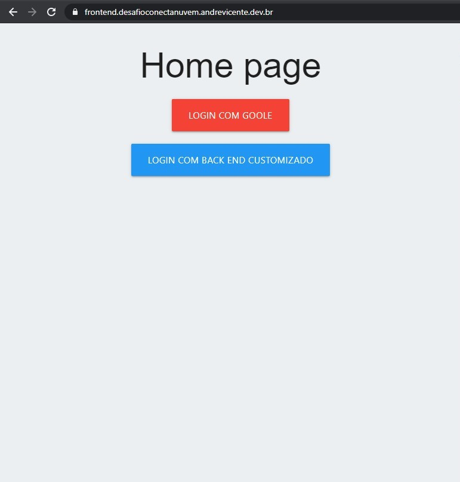
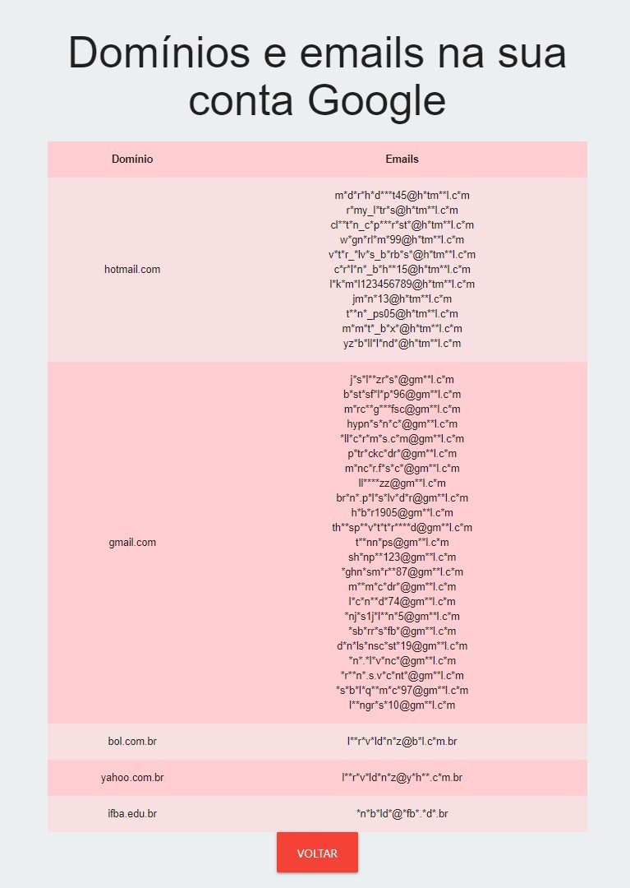
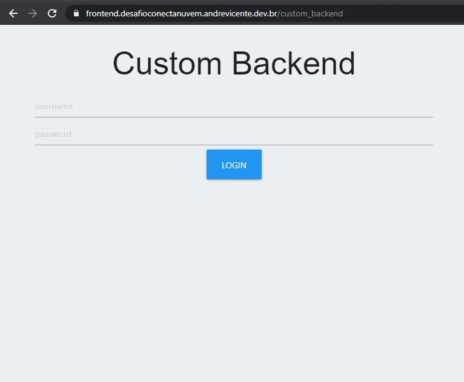
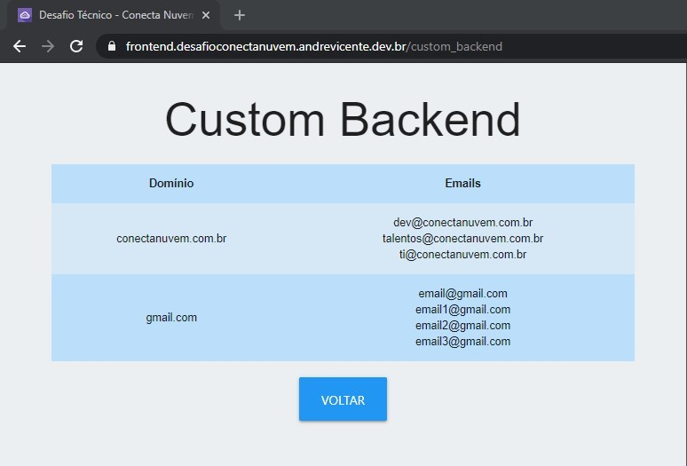

# Desafio Conecta Nuvem

## Description

Programming challenge proposed by [Conecta Nuvem](https://conectanuvem.com.br/).  
The goal in the front-end was to consume Google's People API, more specifically 
the user's email list, and separate in a table organized by domain.  
The goal in the back-end is to replicate the Google's API.  
Project running at https://frontend.desafioconectanuvem.andrevicente.dev.br and
at https://backend.desafioconectanuvem.andrevicente.dev.br.   
Check the [front end readme](front_end/readme.md) and the [back end readme](back_end/readme.md).

## Technologies
- Front-end
  - [node.js](https://nodejs.org/)
  - [vue.js 3](https://v3.vuejs.org/)
  - [TypeScript](https://www.typescriptlang.org/)
  - [Materialize CSS](https://materializecss.com/)
- Back-end
  - [Python](https://python.org/)
  - [Flask](https://flask.palletsprojects.com/)
  - [Firebase](http://firebase.google.com/)

## Screenshots

